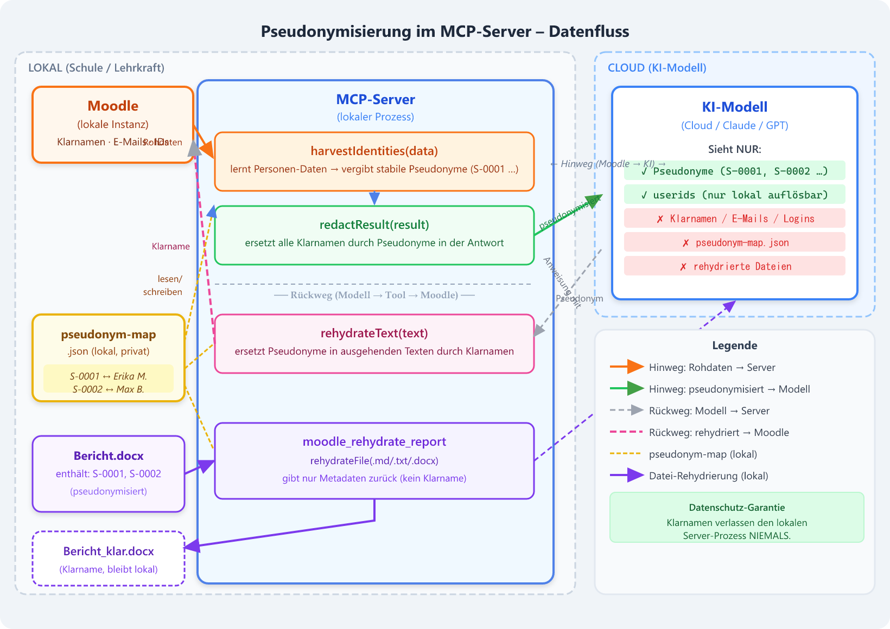

# Moodle Agent MCP Server

Ein [Model Context Protocol (MCP)](https://modelcontextprotocol.io) Server, der Claude Code und andere KI-Assistenten mit einer Moodle-Instanz verbindet. Er ermöglicht das Überwachen von Lernfortschritten, das Lesen und Bewerten von Schülerabgaben sowie das direkte Kommunizieren mit Schülern – alles über natürliche Sprache.

---

## Inhaltsverzeichnis

- [Features](#features)
- [Voraussetzungen](#voraussetzungen)
- [Installation](#installation)
- [Moodle-Konfiguration](#moodle-konfiguration)
- [MCP-Server registrieren](#mcp-server-registrieren)
  - [Claude Code CLI](#claude-code-cli)
  - [Claude Desktop](#claude-desktop)
- [Verfügbare Tools](#verfügbare-tools)
- [Use Cases](#use-cases)
- [Datenschutz & Pseudonymisierung](#datenschutz--pseudonymisierung)
- [Technische Details](#technische-details)

---

## Features

- **Aktivitätsabschlüsse überwachen** – Wer hat welche Aktivität abgeschlossen?
- **Abgaben lesen** – Inline-Texteingaben, Code-Dateien, Bilder und PDFs direkt im KI-Kontext
- **Automatisches Feedback** – KI bewertet Abgaben und speichert Note + Kommentar in Moodle
- **Batch-Benotung** – ganze Klasse (~25 Abgaben) in einem einzigen Moodle-Call benoten statt 25 sequenzieller Round-Trips
- **Batch-Download** – alle Abgabedateien einer Aufgabe parallel herunterladen
- **Quiz-Ergebnisse auswerten** – Versuche und beste Noten pro Schüler oder Kurs
- **Noten-Übersicht** – Komplettes Bewertungsbuch abrufbar
- **Mitteilungen senden** – Direkte Moodle-Nachrichten an einzelne Schüler oder ganze Kurse
- **Datenschutz (DSGVO)** – Serverseitige Pseudonymisierung: Klarnamen verlassen den Server nicht; Berichte lokal rehydrieren

---

## Voraussetzungen

- Node.js 18 oder höher
- Eine Moodle-Instanz (≥ Moodle 3.6) mit aktivierten Web Services
- Claude Code CLI
- Für `.docx`-Rehydrierung: keine weiteren Abhängigkeiten – läuft vollständig in Node.js (JSZip)

---

## Installation

```bash
# Repository klonen oder Verzeichnis anlegen
git clone <repo-url> MoodleAgentMCP
cd MoodleAgentMCP

# Abhängigkeiten installieren
npm install

# TypeScript kompilieren
npm run build
```

---

## Moodle-Konfiguration

### 1. Web Services aktivieren

`Website-Administration → Erweiterte Funktionen → Web Services aktivieren ✓`

### 2. REST-Protokoll aktivieren

`Website-Administration → Server → Web Services → Protokolle verwalten → REST aktivieren ✓`

### 3. Eigenen Service anlegen

`Website-Administration → Server → Web Services → Externe Services → Neuen Service hinzufügen`

- Name: `MoodleAgentMCP`
- Aktiviert: ✓
- Alle Nutzer dürfen ihn verwenden: ✗ (nur der Token-Inhaber)

Dem Service folgende Funktionen hinzufügen:

| Moodle-Funktion | Verwendet von |
|---|---|
| `core_enrol_get_enrolled_users` | Schüler-Liste |
| `core_completion_get_activities_completion_status` | Aktivitätsabschlüsse |
| `core_course_get_contents` | Kursmodule |
| `core_course_get_courses` | Kurs-Metadaten (Titel, Datum, …) |
| `mod_assign_get_submissions` | Abgaben abrufen |
| `mod_assign_get_grades` | Bewertungen lesen (auch für Notenstand in `moodle_get_assignment_submissions`) |
| `mod_assign_save_grade` | Einzelne Bewertung + Feedback speichern (Fallback) |
| `mod_assign_save_grades` | Batch-Benotung ganzer Klassen in einem Call |
| `mod_quiz_get_user_attempts` | Quiz-Versuche |
| `mod_quiz_get_user_best_grade` | Beste Quiz-Note |
| `gradereport_user_get_grade_items` | Bewertungsbuch |
| `core_message_send_instant_messages` | Mitteilungen senden |
| `core_message_get_conversations` | Konversationsliste abrufen |
| `core_message_get_conversation_between_users` | Gesprächsverlauf ermitteln |
| `core_message_get_conversation_messages` | Nachrichten einer Konversation lesen |
| `core_cohort_search_cohorts` | Globale Kohorten durchsuchen |
| `core_cohort_get_cohort_members` | Mitgliedschaft in Kohorten prüfen |
| `core_cohort_get_cohorts` | Alle Kohorten site-weit auflisten (`moodle_list_cohorts`) |
| `core_course_get_course_module` | cmid → courseid/assignid auflösen (`moodle_get_assignment_details`) |
| `mod_assign_get_assignments` | Aufgaben-Details: Beschreibung, Fristen, Bewertungsinfos |

### 4. Token erstellen

`Website-Administration → Server → Web Services → Token verwalten → Neuen Token erstellen`

- Nutzer: Ein Lehrer-Konto mit ausreichenden Rechten
- Service: `MoodleAgentMCP`
- Gültig bis: nach Bedarf

---

## MCP-Server registrieren

### Umgebungsvariablen

Beide Clients benötigen dieselben zwei Variablen:

| Variable | Beschreibung | Beispiel |
|---|---|---|
| `MOODLE_URL` | Basis-URL der Moodle-Instanz, **ohne** abschließenden `/` | `https://moodle.meineschule.de` |
| `MOODLE_TOKEN` | Web Services Token aus [Schritt 4](#4-token-erstellen) | `abc123def456...` |
| `REDACT_PII` | `1` (Standard) = Pseudonymisierung aktiv; `0` = aus (nur Debugging) | `1` |
| `PSEUDONYM_MAP` | Pfad zur vertraulichen Zuordnungsdatei (Standard: `pseudonym-map.json` im Projektstamm) | `/sicherer/pfad/map.json` |
| `REHYDRATE_BASE_DIR` | **Eingabe**-Basisordner für `moodle_rehydrate_report` (pseudonymisierte Vorlage; muss für CoWork beschreibbar sein) | `/home/lehrer/Berichte` |
| `REHYDRATE_OUT_DIR` | Optionaler **getrennter Ausgabeordner** für die rehydrierte Klarnamen-Datei. Gesetzt → Ausgabe nur hierhin, Eingabe wird nie überschrieben. Sollte für CoWork **nicht** lesbar sein. | `/home/lehrer/Dokumente/Berichte-klar` |

---

### Claude Code CLI

Der einfachste Weg: einen einzigen Befehl im Projektverzeichnis ausführen.

```bash
# Im Verzeichnis MoodleAgentMCP ausführen
claude mcp remove moodle-agent 2>/dev/null
claude mcp add \
  -e MOODLE_URL=https://moodle.meineschule.de \
  -e MOODLE_TOKEN=abc123def456... \
  moodle-agent node "$(pwd)/dist/index.js"
```

Unter **Windows (PowerShell)**:

```powershell
# Im Verzeichnis MoodleAgentMCP ausführen
claude mcp remove moodle-agent
claude mcp add `
  -e MOODLE_URL=https://moodle.meineschule.de `
  -e MOODLE_TOKEN=abc123def456... `
  moodle-agent node "$PWD\dist\index.js"
```

Claude Code neu starten. Die Tools erscheinen dann als `mcp__moodle-agent__*`.

> **Tipp:** Mit `-s user` wird der Server global für alle Projekte registriert, ohne `-s` nur für das aktuelle Verzeichnis.

```bash
# Global verfügbar machen (empfohlen für Lehrer-Rechner)
claude mcp add -s user \
  -e MOODLE_URL=https://moodle.meineschule.de \
  -e MOODLE_TOKEN=abc123def456... \
  moodle-agent node "/absoluter/pfad/zu/MoodleAgentMCP/dist/index.js"
```

Registrierung prüfen:

```bash
claude mcp list
# Ausgabe: moodle-agent: node /pfad/dist/index.js
```

---

### Claude Desktop

Claude Desktop liest seine MCP-Konfiguration aus einer JSON-Datei. Diese muss manuell bearbeitet werden.

#### Konfigurationsdatei öffnen

| Betriebssystem | Pfad |
|---|---|
| **Windows** | `%APPDATA%\Claude\claude_desktop_config.json` |
| **macOS** | `~/Library/Application Support/Claude/claude_desktop_config.json` |
| **Linux** | `~/.config/Claude/claude_desktop_config.json` |

Schnell öffnen:

```bash
# Windows (PowerShell)
notepad "$env:APPDATA\Claude\claude_desktop_config.json"

# macOS
open -e ~/Library/Application\ Support/Claude/claude_desktop_config.json

# Linux
xdg-open ~/.config/Claude/claude_desktop_config.json
```

#### Konfiguration eintragen

Den Block `mcpServers` in die JSON-Datei einfügen. Falls die Datei noch nicht existiert, komplett neu anlegen:

**Windows:**

```json
{
  "mcpServers": {
    "moodle-agent": {
      "command": "node",
      "args": ["C:\\Pfad\\zu\\MoodleAgentMCP\\dist\\index.js"],
      "env": {
        "MOODLE_URL": "https://moodle.meineschule.de",
        "MOODLE_TOKEN": "abc123def456..."
      }
    }
  }
}
```

**macOS / Linux:**

```json
{
  "mcpServers": {
    "moodle-agent": {
      "command": "node",
      "args": ["/Users/name/MoodleAgentMCP/dist/index.js"],
      "env": {
        "MOODLE_URL": "https://moodle.meineschule.de",
        "MOODLE_TOKEN": "abc123def456..."
      }
    }
  }
}
```

Falls bereits andere MCP-Server eingetragen sind, den `moodle-agent`-Block in das vorhandene `mcpServers`-Objekt einfügen:

```json
{
  "mcpServers": {
    "anderer-server": { "..." : "..." },
    "moodle-agent": {
      "command": "node",
      "args": ["/pfad/zu/MoodleAgentMCP/dist/index.js"],
      "env": {
        "MOODLE_URL": "https://moodle.meineschule.de",
        "MOODLE_TOKEN": "abc123def456..."
      }
    }
  }
}
```

#### Node.js-Pfad explizit angeben (empfohlen)

Falls `node` nicht im Systempfad von Claude Desktop liegt (häufig auf macOS/Windows), den vollständigen Pfad angeben:

```bash
# Pfad ermitteln
which node          # macOS / Linux  → z.B. /usr/local/bin/node
where node          # Windows CMD    → z.B. C:\Program Files\nodejs\node.exe
(Get-Command node).Source  # PowerShell
```

```json
{
  "mcpServers": {
    "moodle-agent": {
      "command": "/usr/local/bin/node",
      "args": ["/pfad/zu/MoodleAgentMCP/dist/index.js"],
      "env": {
        "MOODLE_URL": "https://moodle.meineschule.de",
        "MOODLE_TOKEN": "abc123def456..."
      }
    }
  }
}
```

#### Claude Desktop neu starten

Nach dem Speichern der Konfigurationsdatei **Claude Desktop vollständig beenden und neu starten** (nicht nur das Fenster schließen).

Verbindung prüfen: In Claude Desktop erscheint unten links ein Hammer-Symbol 🔨. Ein Klick darauf zeigt alle verbundenen MCP-Tools – dort sollten die `moodle_*`-Tools aufgelistet sein.

#### Häufige Probleme

| Problem | Ursache | Lösung |
|---|---|---|
| Tools erscheinen nicht | Ungültiger JSON-Syntax | Datei mit einem JSON-Validator prüfen |
| `node: command not found` | Node nicht im PATH | Vollständigen Node-Pfad in `command` eintragen |
| `MOODLE_URL/TOKEN not set` | Env-Variablen fehlen | `env`-Block in der JSON-Konfiguration prüfen |
| `Moodle-Fehler [invalidtoken]` | Token abgelaufen oder falsch | Neuen Token in Moodle erstellen |
| `HTTP 403` | Fehlende Moodle-Berechtigung | Lehrer-Rolle im Kurs prüfen |

---

## Verfügbare Tools

### Schüler & Kurse

#### `moodle_get_user_groups`
Gibt alle Gruppen und globalen Kohorten zurück, in denen ein Nutzer Mitglied ist – kursübergreifend.

```
userid           (required)  Benutzer-ID
include_cohorts  (optional)  true = auch globale Kohorten abfragen (Standard: true)
```

Rückgabe: `course_groups` (Kurs-Gruppen mit Kursname) und `cohorts` (systemweite Kohorten).

**Kurs-Gruppen** werden über `core_enrol_get_enrolled_users` ermittelt – diese Funktion ist bereits im Service enthalten und liefert pro Nutzer ein `groups`-Feld. Keine zusätzliche Moodle-Funktion nötig.

**Globale Kohorten** erfordern zwei weitere Funktionen im Service:
- `core_cohort_search_cohorts`
- `core_cohort_get_cohort_members`

> Ohne diese Funktionen liefert das Tool trotzdem die Kurs-Gruppen. Kohorten werden dann mit einem Hinweis übersprungen.

#### `moodle_get_course_info`
Gibt Metadaten eines oder mehrerer Kurse zurück.

```
courseids  (optional)  Array von Kurs-IDs – ohne Angabe werden ALLE Kurse abgerufen
```

Rückgabefelder pro Kurs: `id`, `fullname`, `shortname`, `summary` (HTML-bereinigt, max. 300 Zeichen), `format`, `categoryid`, `startdate`, `enddate`, `visible`, `numsections`, `lang`

#### `moodle_get_enrolled_students`
Gibt alle eingeschriebenen Nutzer eines Kurses zurück.

```
courseid (required)  Kurs-ID (steht in der Moodle-URL: ?id=XX)
```

#### `moodle_get_course_modules`
Listet alle Kursaktivitäten mit `cmid`, `instance`-ID, Modultyp und Abschlusskonfiguration.

```
courseid (required)
modtype  (optional)  Filter: 'assign', 'quiz', 'page', 'url', ...
```

#### `moodle_get_assignment_details`
Liest Beschreibung (HTML-Intro), Abgabefristen und Bewertungsinfos einer Aufgabe.  
Die `cmid` ist der `id`-Parameter direkt aus der Moodle-URL (z. B. `view.php?id=9683`).

```
cmid (required)  Course-Module-ID aus der Moodle-URL
```

Intern werden automatisch `core_course_get_course_module` (cmid → courseid + assignid) und `mod_assign_get_assignments` kombiniert — keine manuelle Kurs-ID nötig.

---

### Aktivitätsabschlüsse

#### `moodle_get_activity_completion`
Zeigt für jeden Schüler, welche Aktivitäten abgeschlossen wurden.

```
courseid (required)
userid   (optional)  Ohne Angabe: alle Schüler des Kurses
```

---

### Aufgaben & Abgaben

#### `moodle_get_assignment_submissions`
Abgabe-Daten für eine oder mehrere Aufgaben – inkl. aktuellem Notenstand.

```
assignmentids (required)  Array von Aufgaben-IDs
status        (optional)  '', 'draft', 'submitted', 'reopened'
```

Pro Abgabe werden automatisch `grade` (aktuelle Note oder `null`) und `grade_timemodified` (Zeitstempel der Benotung oder `null`) ergänzt. Damit lässt sich allein aus diesem Response ermitteln, ob eine Abgabe noch nicht benotet oder seit der letzten Benotung verändert wurde:

```
submission.timemodified > grade_timemodified  →  neu abgegeben, noch nicht benotet
grade_timemodified == null                    →  noch gar keine Note
```

Intern werden `mod_assign_get_submissions` und `mod_assign_get_grades` parallel abgerufen und per `userid` gejoined. Die `userid` ist eine Zahl und wird von der Pseudonymisierung nicht verändert – die Zuordnung Schüler ↔ Note bleibt korrekt.

#### `moodle_get_submission_content`
Liest den Inhalt einer einzelnen Abgabe vollständig aus:
- **Online-Texteingabe** → wird direkt als HTML zurückgegeben
- **Hochgeladene Dateien** → Liste mit Metadaten und authentifizierten Download-URLs

```
assignid (required)  Aufgaben-ID
userid   (required)  Benutzer-ID des Schülers
```

#### `moodle_download_submission_file`
Lädt eine Abgabedatei herunter und gibt den Inhalt zurück:

| Dateityp | Rückgabe |
|---|---|
| Text / Code (`.py`, `.js`, `.html`, `.txt`, `.csv`, …) | Lesbarer Textinhalt |
| Bilder (`.jpg`, `.png`, `.webp`, …) | Bild-Daten (direkt für Claude lesbar) |
| PDFs | Base64-kodiert (Claude kann es lesen) |
| Word / Excel | Download-URL (manuelles Öffnen erforderlich) |

```
fileurl  (required)  URL aus moodle_get_submission_content
filename (optional)  Dateiname für MIME-Typ-Erkennung
```

#### `moodle_get_submission_details`
Gibt Abgabe-Metadaten + vorhandene Bewertung eines Schülers zurück.

```
assignid (required)
userid   (required)
```

#### `moodle_grade_assignment`
Speichert eine Note und schriftliches Feedback direkt in Moodle (einzelner Schüler).

```
assignid      (required)  Aufgaben-ID
userid        (required)  Benutzer-ID
grade         (required)  Note (passend zur Aufgaben-Skala, z.B. 0–100)
feedback      (required)  Feedback-Text (HTML erlaubt)
workflowstate (optional)  'released' = sofort für Schüler sichtbar
```

#### `moodle_grade_assignments_batch`
Benotet eine ganze Klasse in **einem** Moodle-Call statt in 25 sequenziellen Aufrufen.

```
assignid (required)  Aufgaben-ID
grades   (required)  Array mit einem Eintrag pro Schüler:
  userid        (required)  Benutzer-ID
  grade         (required)  Note (z.B. 0–100; -1 = keine Bewertung)
  feedback      (required)  Feedback-Text (HTML erlaubt, Pseudonyme werden lokal ersetzt)
  workflowstate (optional)  'released' (Standard) | 'readyforreview' | 'inreview' | 'readyforrelease'
```

Rückgabe: `{ summary: "25/25 Bewertungen gespeichert", results: [{ userid, ok, error? }, …] }`

Intern wird `mod_assign_save_grades` genutzt (nativer Array-Call). Schlägt der Batch fehl, wird automatisch auf individuelle `mod_assign_save_grade`-Calls zurückgefallen, um Teilerfolge zu ermitteln.

**Benötigte Moodle-Capability:** `mod/assign:grade`

#### `moodle_download_all_submissions`
Lädt alle Abgabedateien einer Aufgabe **parallel** herunter – deutlich schneller als sequentielles `moodle_download_submission_file` für ganze Klassen.

```
assignid (required)  Aufgaben-ID
status   (optional)  Filter: 'submitted' (Standard) | '' | 'draft' | 'reopened'
```

Rückgabe: `{ summary: "23/25 Dateien geladen", files: [{ userid, filename, mimetype, size_bytes, data_base64, ok }, …] }`

Die `userid` ist ein numerischer Schlüssel und wird nicht pseudonymisiert – die Zuordnung `userid ↔ Datei-Bytes` ist eindeutig und korrumpiert-frei.

> **TODO:** PDF → PNG-Konvertierung via `pdftoppm` (~100 dpi) ist noch nicht implementiert (erfordert System-Dependency). Die rohen PDF-Bytes werden als Base64 zurückgegeben.

#### `moodle_get_assignment_feedback`
Liest vorhandenes Feedback und Note für eine Abgabe aus.

```
assignid (required)
userid   (required)
```

---

### Quiz

#### `moodle_get_quiz_results`
Gibt Quiz-Ergebnisse zurück.

```
quizid   (required)
userid   (optional)  Einzelner Schüler: alle Versuche
courseid (optional)  Ohne userid: beste Note aller Schüler
status   (optional)  'all', 'finished', 'unfinished'
```

---

### Noten

#### `moodle_get_course_grades`
Vollständiges Bewertungsbuch eines Kurses.

```
courseid (required)
userid   (optional)  Ohne Angabe: alle Schüler
```

---

### Kommunikation

#### `moodle_get_messages`
Liest Nachrichten aus dem Posteingang oder -ausgang eines Nutzers.

```
userid     (required)  Benutzer-ID
type       (optional)  'conversations' (Standard) | 'notifications'
direction  (optional)  'received' = Eingang (Standard) | 'sent' = Ausgang
read       (optional)  true = nur gelesene | false = nur ungelesene | weggelassen = alle
limit      (optional)  Anzahl Nachrichten (Standard: 50)
offset     (optional)  Pagination-Offset (Standard: 0)
```

#### `moodle_get_conversations`
Listet alle Konversationen eines Nutzers auf mit letzter Nachricht und Anzahl ungelesener Nachrichten.

```
userid       (required)  Benutzer-ID
type         (optional)  1 = Einzelgespräche (Standard) | 2 = Gruppen
unread_only  (optional)  true = nur Konversationen mit ungelesenen Nachrichten
limit        (optional)  Anzahl Konversationen (Standard: 20)
offset       (optional)  Pagination-Offset (Standard: 0)
```

#### `moodle_get_conversation_with_user`
Liest den kompletten chronologischen Nachrichtenverlauf zwischen zwei Nutzern.

```
userid       (required)  Eigene Benutzer-ID (Lehrer)
otheruserid  (required)  Benutzer-ID des Schülers
limit        (optional)  Anzahl Nachrichten (Standard: 100)
offset       (optional)  Pagination-Offset (Standard: 0)
```

---

#### `moodle_send_message`
Sendet eine direkte Moodle-Mitteilung an einzelne Schüler.

```
userids  (required)  Array von Benutzer-IDs
message  (required)  Nachrichtentext (HTML erlaubt)
subject  (optional)  Betreff (wird fett vorangestellt)
format   (optional)  0=Moodle, 1=HTML (Standard), 2=Plain-Text, 4=Markdown
```

#### `moodle_send_message_to_course`
Sendet eine Mitteilung an **alle** Schüler eines Kurses (automatische Batches à 50).

```
courseid (required)
message  (required)
subject  (optional)
format   (optional)
```

---

### Datenschutz

#### `moodle_resolve_student`
Löst einen Schülernamen (oder Namensteil / E-Mail / Login) **lokal** zu `userid` + Pseudonym auf.  
Gibt **keine Klarnamen** zurück – nur den technischen Schlüssel.

```
query    (required)  Name, Namensteil, E-Mail oder Login
courseid (optional)  Kurs-ID, um die Zuordnung vor der Auflösung zu befüllen
```

#### `moodle_list_cohorts`
Listet alle site-weiten Kohorten (globale Gruppen) auf – inklusive optionaler Mitgliederliste.  
Mitglieder werden **pseudonymisiert** zurückgegeben (userid + Pseudonym, kein Klarname).

```
include_members  (optional)  true = Mitgliederliste laden (Standard: true); false = nur Metadaten
cohortids        (optional)  Array von Kohorten-IDs – ohne Angabe werden ALLE Kohorten abgerufen
```

**Voraussetzungen:** Die folgenden Funktionen müssen dem Webservice-Token zugeordnet sein:
- `core_cohort_get_cohorts` (Kohortenmetadaten)
- `core_cohort_get_cohort_members` (Mitgliederliste, nur bei `include_members=true`)

**Beispiel-Rückgabe:**
```json
{
  "total_cohorts": 2,
  "cohorts": [
    {
      "id": 5,
      "name": "FIAE24",
      "idnumber": "fiae24",
      "contextid": 1,
      "description": "Fachinformatiker Anwendungsentwicklung Klasse 2024",
      "visible": true,
      "member_count": 22,
      "members": [
        { "userid": 42, "pseudonym": "S-0001" },
        { "userid": 17, "pseudonym": "S-0002" }
      ]
    }
  ]
}
```

#### `moodle_rehydrate_report`
Ersetzt Pseudonyme (`S-0001`, …) in einer lokalen Berichtsdatei durch echte Namen.  
Die Klarnamen verlassen dabei **niemals den Server** – der Rückgabewert enthält nur Metadaten.

```
infile   (required)  Pfad zur Eingabedatei (relativ zu REHYDRATE_BASE_DIR oder absolut darin)
                     Unterstützte Formate: .md, .txt, .docx
outfile  (optional)  Ausgabedatei. Mit REHYDRATE_OUT_DIR relativ zu diesem getrennten
                     Ordner; ohne OUT_DIR relativ zu REHYDRATE_BASE_DIR (Standard: in-place)
field    (optional)  Welches Klardaten-Feld einsetzen: fullname (Standard) | email | username
```

**Rückgabe** (kein Klarname enthalten):
```json
{
  "ok": true,
  "datei": "Klassenbericht.klar.md",
  "pseudonyme_ersetzt": 3,
  "schueler": ["S-0001", "S-0002", "S-0003"],
  "field": "fullname",
  "ausgabe_getrennt": true
}
```

Ist `REHYDRATE_OUT_DIR` **nicht** gesetzt und die Klartext-Ausgabe landet damit im
(für CoWork lesbaren) Eingabeordner, enthält das Ergebnis zusätzlich ein Feld
`"warnung"` mit einem Datenschutzhinweis und `"ausgabe_getrennt": false`.

**Sicherheit:**
- Pfad-Traversal (`..`) und absolute Pfade außerhalb des erlaubten Ordners werden abgewiesen.
- **Getrennter Ausgabeordner:** Der Eingabeordner (`REHYDRATE_BASE_DIR`) muss für den
  MCP-Client (CoWork) beschreibbar sein, damit dort die *pseudonymisierte* Vorlage abgelegt
  werden kann. Die rehydrierte Ausgabe enthält jedoch Klarnamen – läge sie im selben,
  lesbaren Ordner, könnte das Modell sie zurücklesen. Mit `REHYDRATE_OUT_DIR` wird die
  Klartext-Ausgabe in einen separaten, für CoWork idealerweise **nicht lesbaren** Ordner
  geschrieben; die Eingabe wird dabei nie überschrieben.
- `.docx`-Verarbeitung vollständig in Node.js via **JSZip**: öffnet das DOCX-ZIP, ersetzt Pseudonyme in `word/document.xml` sowie allen Header-/Footer-Parts, schreibt das ZIP zurück. Kein Python, keine externe Abhängigkeit.

---

## Use Cases

### 1. Automatisches Code-Review und Batch-Feedback (optimiert)

**Szenario:** Eine Informatik-Klasse hat eine Python-Aufgabe abgegeben. Der Lehrer möchte für jeden Schüler automatisch Feedback generieren lassen – schnell für eine ganze Klasse.

**Prompt:**
> „Hol alle Abgabedateien für Python-Aufgabe (ID 23) auf einmal. Nur Schüler, die seit der letzten Bewertung etwas geändert haben oder noch gar keine Note haben, prüfen. Für jeden betroffenen Schüler: Code-Review, Note 0–100, konstruktives Feedback. Alle auf einmal in Moodle speichern."

**Tool-Kette (optimiert mit Batch-Tools):**
```
moodle_get_assignment_submissions (assignmentids: [23])
  → [KI filtert: grade==null oder submission.timemodified > grade_timemodified]
moodle_download_all_submissions (assignid: 23)
  → [alle Dateien in einem Parallelaufruf]
  → [KI analysiert jeden Code]
moodle_grade_assignments_batch (
  assignid: 23,
  grades: [
    { userid: 11, grade: 87, feedback: "...", workflowstate: "released" },
    { userid: 14, grade: 73, feedback: "...", workflowstate: "released" },
    …  // ganze Klasse in einem Call
  ]
)
```

> Statt ~75 sequenzieller Moodle-Round-Trips (3 pro Schüler × 25) reduziert sich das auf 3 Calls insgesamt.

---

### 2. Lernfortschritt-Überwachung

**Szenario:** Vor einer Klassenarbeit möchte der Lehrer wissen, welche Schüler die vorbereitenden Aktivitäten noch nicht abgeschlossen haben.

**Prompt:**
> „Zeig mir für Kurs 12, welche Schüler die Aktivitäten in Abschnitt 3 noch nicht abgeschlossen haben. Schick denjenigen, die mehr als 2 Aktivitäten offen haben, eine Erinnerungs-Mitteilung."

**Tool-Kette:**
```
moodle_get_activity_completion (courseid: 12)
  → [KI filtert Schüler mit offenen Aktivitäten]
moodle_send_message (userids: [...], subject: "Erinnerung", message: "...")
```

---

### 3. Quiz-Auswertung und Nachbesprechung

**Szenario:** Nach einem Online-Test soll die KI eine Übersicht erstellen und Schüler mit schlechten Ergebnissen ansprechen.

**Prompt:**
> „Werte das Quiz 'Netzwerkgrundlagen' (ID 8) in Kurs 5 aus. Erstelle eine Übersicht aller Ergebnisse, berechne den Klassendurchschnitt und schick den Schülern unter 50 Punkten eine persönliche Nachricht mit dem Angebot einer Nachbesprechung."

**Tool-Kette:**
```
moodle_get_enrolled_students (courseid: 5)
moodle_get_quiz_results (quizid: 8, courseid: 5)
  → [KI berechnet Durchschnitt, identifiziert Schüler unter 50%]
moodle_send_message (
  userids: [schwache Schüler],
  subject: "Nachbesprechung Quiz",
  message: "Hallo ..., du hast X Punkte erreicht ..."
)
```

---

### 4. Abgabe-Erinnerungen versenden

**Szenario:** Die Abgabefrist für eine Projektarbeit läuft in 2 Tagen ab. Der Lehrer möchte alle Schüler erinnern, die noch nicht abgegeben haben.

**Prompt:**
> „Prüfe für Aufgabe 31 in Kurs 9, welche Schüler noch nicht abgegeben haben, und schick ihnen eine Erinnerungs-Mitteilung mit dem Hinweis auf die Abgabefrist am Freitag."

**Tool-Kette:**
```
moodle_get_enrolled_students (courseid: 9)
moodle_get_assignment_submissions (assignmentids: [31])
  → [KI vergleicht: eingeschrieben vs. abgegeben → findet Schüler ohne Abgabe]
moodle_send_message (
  userids: [Schüler ohne Abgabe],
  subject: "Erinnerung: Abgabefrist Freitag",
  message: "..."
)
```

---

### 5. Bewertungs-Konsistenz-Check

**Szenario:** Der Lehrer hat manuell benotet und möchte prüfen, ob die Noten fair und konsistent vergeben wurden.

**Prompt:**
> „Hol alle Abgaben und Bewertungen für Aufgabe 15 in Kurs 3. Lade die Texte herunter und prüfe ob die vergebenen Noten im Verhältnis zur Qualität der Abgaben stehen. Gib mir eine Tabelle mit deiner Einschätzung."

**Tool-Kette:**
```
moodle_get_assignment_submissions (assignmentids: [15])
  → für jeden Schüler:
    moodle_get_submission_content (...)
    moodle_get_assignment_feedback (...)
    [KI vergleicht Abgabe ↔ Note]
  → Tabelle ausgeben
```

---

### 6. Kurs-Statusbericht erstellen

**Szenario:** Wöchentlicher Überblick über den Lernfortschritt der Klasse.

**Prompt:**
> „Erstelle einen Wochenbericht für Kurs 6: Welche Aktivitäten wurden abgeschlossen? Wie sind die Quiz-Ergebnisse? Welche Aufgaben sind bewertet, welche noch offen? Fasse alles kompakt zusammen."

**Tool-Kette:**
```
moodle_get_activity_completion (courseid: 6)
moodle_get_course_modules (courseid: 6)
moodle_get_course_grades (courseid: 6)
  → [KI aggregiert und fasst zusammen]
```

---

### 7. Schülerantworten lesen und weiter kommunizieren

**Szenario:** Der Lehrer hat eine Erinnerungsnachricht an die Klasse gesendet. Nun möchte er sehen, welche Schüler geantwortet haben, und auf Rückfragen eingehen.

**Prompt:**
> „Prüfe den Posteingang von Nutzer 3 (Lehrer) auf ungelesene Nachrichten. Zeige mir den vollständigen Gesprächsverlauf mit jedem Schüler, der geantwortet hat, und formuliere passende Antworten."

**Tool-Kette:**
```
moodle_get_messages (userid: 3, direction: 'received', read: false)
  → [KI findet Antworten von Schüler 17 und 23]
moodle_get_conversation_with_user (userid: 3, otheruserid: 17)
moodle_get_conversation_with_user (userid: 3, otheruserid: 23)
  → [KI liest Kontext und formuliert Antworten]
moodle_send_message (userids: [17], message: "Hallo ...")
moodle_send_message (userids: [23], message: "Hallo ...")
```

---

### 8. Persönliches Feedback nach Prüfungsergebnis

**Szenario:** Nach einer Prüfung soll jeder Schüler eine personalisierte Nachricht mit seinem Ergebnis und individuellen Tipps erhalten.

**Prompt:**
> „Schick jedem Schüler in Kurs 4 eine persönliche Nachricht mit seinem Quiz-Ergebnis (Quiz-ID 11) und 2–3 individuellen Lerntipps basierend auf seiner Punktzahl."

**Tool-Kette:**
```
moodle_get_enrolled_students (courseid: 4)
  → für jeden Schüler:
    moodle_get_quiz_results (quizid: 11, userid: X)
    [KI generiert personalisierte Tipps]
    moodle_send_message (userids: [X], message: "Hallo ..., du hast ...")
```

---

### 9. Pseudonymisierten Bericht rehydrieren

**Szenario:** Der Lehrer lässt die KI einen Lernstandsbericht als Markdown-Datei erstellen. Da `REDACT_PII=1` aktiv ist, enthält der Bericht nur Pseudonyme (`S-0001`, …). Vor dem Ausdrucken oder Versenden sollen die echten Namen eingesetzt werden.

**Prompt:**
> „Erstelle einen Lernstandsbericht für Kurs 7 als Markdown-Datei `Berichte/lernstand_kurs7.md` mit Aktivitätsabschlüssen und Noten. Rehydriere danach die Datei mit den echten Namen."

**Tool-Kette:**
```
moodle_get_activity_completion (courseid: 7)
moodle_get_course_grades (courseid: 7)
  → [KI erstellt lernstand_kurs7.md in REHYDRATE_BASE_DIR mit Pseudonymen]
moodle_rehydrate_report (
  infile: "lernstand_kurs7.md",
  outfile: "lernstand_kurs7_klar.md",
  field: "fullname"
)
  → { ok: true, pseudonyme_ersetzt: 24, schueler: ["S-0001", …], field: "fullname" }
```

> **Hinweis:** Die Datei `lernstand_kurs7_klar.md` enthält jetzt echte Namen – sie liegt ausschließlich lokal und wurde **nicht** an das Modell übertragen.

---

## Datenschutz & Pseudonymisierung

Der MCP-Server ist die letzte Station unter Kontrolle der Schule, bevor Tool-Ergebnisse an das (Cloud-)Modell gehen. Hier greift die serverseitige Pseudonymisierung:

```
Moodle (lokal) ──▶ MCP-Server (lokal) ──▶ [Redaktion] ──▶ Modell (Cloud)
                                               │
                              pseudonym-map.json (vertraulich, bleibt lokal)
```



### Hinweg (Moodle → Modell)

Jede Moodle-Antwort wird vor der Ausgabe bereinigt: `fullname`, `firstname`, `lastname`, `email` und `username` werden durch stabile Pseudonyme (`S-0001`, `S-0002`, …) ersetzt – auch in Freitext (Feedback, Nachrichten, Abgabe-Inhalte).  
Die numerische `userid` bleibt erhalten (ohne Moodle-Zugriff nicht auflösbar).

### Rückweg (Modell → Moodle)

Ausgehende Texte (Nachrichten, Feedback) werden **vor** dem Moodle-Aufruf rehydriert: `S-0002` → echter Vorname. Der Empfänger sieht seinen echten Namen, das Modell hat ihn nie gesehen.

### Berichtsdateien

Lokale Dateien (`.md`, `.txt`, `.docx`) können mit `moodle_rehydrate_report` rehydriert werden. Klarnamen erscheinen nur in der Ausgabedatei – nicht im Modell-Kontext und nicht im Tool-Rückgabewert.

### Konfiguration

| Variable | Standard | Bedeutung |
|---|---|---|
| `REDACT_PII` | `1` | `0` = Redaktion deaktiviert (nur Debugging) |
| `PSEUDONYM_MAP` | `pseudonym-map.json` | Pfad zur vertraulichen Zuordnungsdatei |
| `REHYDRATE_BASE_DIR` | `../MoodleTutor/Berichte` | Eingabeordner (pseudonymisierte Vorlage; für CoWork beschreibbar) |
| `REHYDRATE_OUT_DIR` | _(nicht gesetzt)_ | Optional: getrennter Ausgabeordner für die Klarnamen-Datei (für CoWork möglichst nicht lesbar) |

> Die Datei `pseudonym-map.json` ist durch `.gitignore` vom Commit ausgeschlossen und darf niemals an Modell, Client oder Cloud weitergegeben werden.

---

## Technische Details

### Architektur

```
Claude Code / KI-Assistent
        │  MCP-Protokoll (stdio)
        ▼
  moodle-agent-mcp (Node.js)
        │  HTTP REST (application/x-www-form-urlencoded)
        ▼
  Moodle Web Services API
        │
        ▼
  Moodle-Datenbank
```

### Datei-Download-Logik

Moodle-Datei-URLs aus der REST-API werden durch Anhängen von `?token=TOKEN` authentifiziert. Der Server erkennt den Dateityp anhand des `Content-Type`-Headers und der Dateiendung:

- **Text/Code** → direkt als UTF-8-String
- **Bilder** → Base64 (MCP `image`-Content-Type, Claude kann sie sehen)
- **PDFs** → Base64 als Text (Claude kann PDFs lesen)
- **Sonstige Binärdateien** → Nur Metadaten + Download-URL

### Batching

`moodle_send_message_to_course` verarbeitet Empfänger in Batches à 50, da Moodle die Anzahl gleichzeitiger Nachrichten begrenzt.

`moodle_grade_assignments_batch` nutzt `mod_assign_save_grades` – einen nativen Moodle-Webservice, der ein Array von Bewertungen in einem einzigen HTTP-Call speichert. Bei Fehler des Batch-Calls wird automatisch auf individuelle `mod_assign_save_grade`-Aufrufe zurückgefallen, um Teilerfolge zu ermitteln.

`moodle_download_all_submissions` lädt alle Abgabedateien einer Aufgabe parallel (Node.js `Promise.all`). Die `userid` pro Datei bleibt als numerischer Schlüssel erhalten und wird nicht pseudonymisiert, sodass die Zuordnung `userid ↔ Datei-Bytes` eindeutig ist.

### Fehlerbehandlung

Jeder Tool-Aufruf gibt bei Moodle-seitigen Fehlern (z.B. fehlende Berechtigungen, ungültige IDs) eine strukturierte Fehlermeldung zurück, ohne den MCP-Server zu beenden.

### Benötigte Moodle-Berechtigungen

Der Token-Inhaber (Lehrer-Konto) benötigt in den jeweiligen Kursen mindestens die Rolle **Trainer/Lehrer**, um Bewertungen schreiben und Abgaben lesen zu können.
